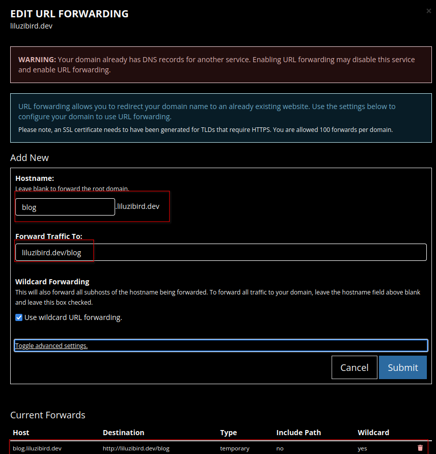

[*Picture from digitalmarketing.com*](http://digitalreadymarketing.com/advantage-302-redirect)

So over the course of this week, I didn't want to do my math homework, so I bought a domain and started moving my blog and changing my portfolio website over. It has been a tough journey and I there have been many hiccups along the way, probably messed up the few people who read my site but, it all worked out in the end.

One of the main struggles of the migration was figuring out how I wanted to have my website structured. I was in between having it as blog.liluzibird.dev or liluzibird.dev/blog, so I ended up deciding on liluzibird.dev/blog. Now, as I am typing it, I realize that it should've stayed as blog.liluzibird.dev...I think I'm gonna change it again.

Well...anyway, I did it and here are the steps. Very straightforward though if you just follow porkbun's guide. Porkbun is where I bought my domain and I highly recommend it as well. They are cheap and very helpful.

https://kb.porkbun.com/article/39-how-to-set-up-url-forwarding

Basically, that's it. That handles everything, make sure to leave everything else default like the wildcard and the temporary redirect in advanced settings. There's little reason to redirect it permanently, because you may want to change it back in the future or undo your changes like what I am trying to do now.

Anyway, thanks for reading, by the next time you go to this blog page again, I'll probably redirect it back to https://blog.liluzibird.dev/.