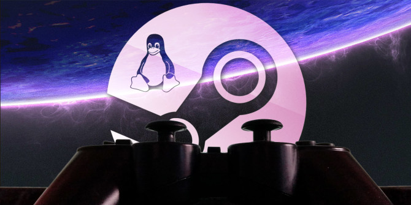

# Gaming

*Stolen from https://www.gamingonlinux.com/articles/how-to-enable-steam-play-proton-directly-in-steamos.13295/page=2/*

Some weird stuff I gotta do to get games to work on my Linux system (I use Arch btw)

If you guys don't got any friends, my Steam is [liluzibird](https://steamcommunity.com/id/liluzibird/)