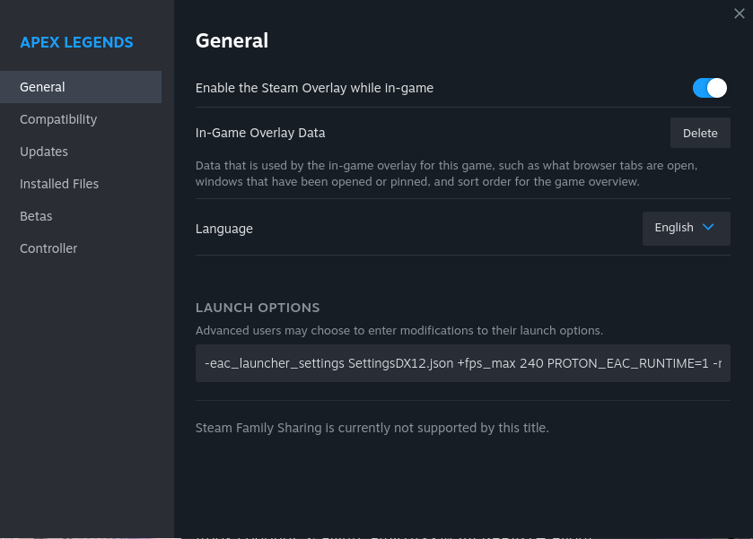

*Image stolen from https://store.steampowered.com/app/1172470/Apex_Legends/*

So over my winter break I've been doing a little gaming here and there. One day, my friends invited me to play Apex Legends. So I decided to hop check out [protondb](https://www.protondb.com/) and give it a try. Much to my luck Apex Legends actually works (with a few tweaks).

---


Pretty much, all you have to do is run this line through the Steam launcher's launch options:

```
-eac_launcher_settings SettingsDX12.json +fps_max 200 PROTON_EAC_RUNTIME=1 -novid -preload

```
