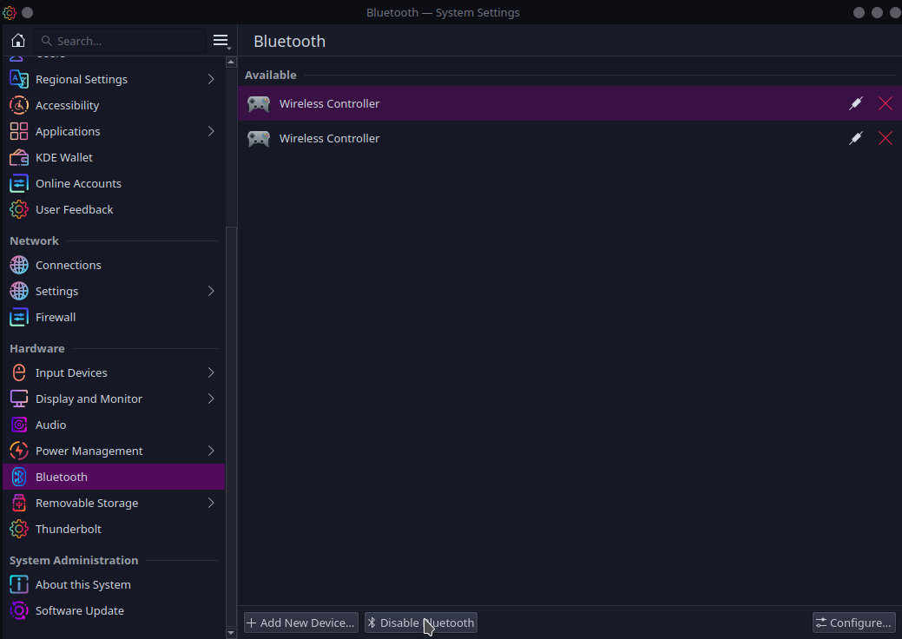
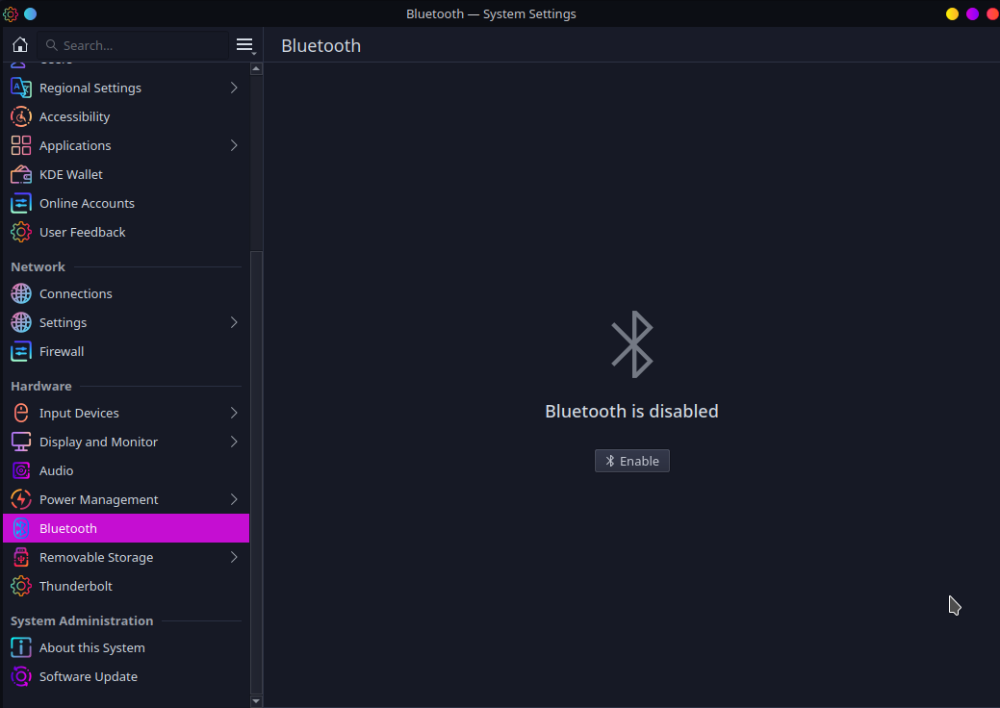

Over the weekend, I was doing some gaming on my laptop with some newly purchased bluetooth controllers I just purchased. For some reason my download speeds were hovering around 1mbps to 10 mbps. First, I thought it was my VPN, I've connected to various regions, and it wouldn't fix my issue. Second, I tested my DNS server, as that might cause issues, so I restarted my server, still, no dice. So then I checked if there was something wrong with the provider, I went to another computer that was hardwired into the router and it was getting the normal 400 mbps speeds, so that wasn't the issue. Eventually, my controller shut off, due to being inactive for so long. Suddenly, the speeds jumped up to like 60mbps.

So let this be a lesson to you all, disconnect your controllers before downloading games. 

Pretty obvious, but this is how to disable Bluetooth in KDE Plasma 5. (I'm using the Sweet global theme btw)

