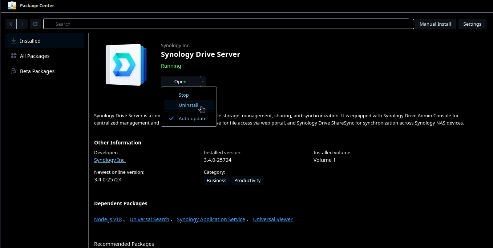

## Preface
So as stated in my last post about the Docker name change, that issue arose from me updating my server to DSM 7.2. Would you believe it if I told you that wasn't the only issue that I encountered? Along with that whole Docker name change, Synology Drive also messed up, and that included its dependencies like Synology Photos. I had to fix that ASAP as I had many users using those services.

## Flashbacks
Not too long ago did I have an issue where I was filling up with storage because by Drive Manager had like 5 backups for every file that my users had on the server so that filled up with space. I believe now there's only 1 backup or maybe none at all. That was a huge headache but I constantly thought of that incident as I was trying to fix this mistake.

## Troubleshooting
So what happened and how did I fix it you ask. Well, it didn't work. I first noticed it because I have a folder where Super Productivity (it seems I have not written about this program yet, I might have to do so in the future) is located and I back up that folder between my PC, Laptop, and Phone so I can keep track of my daily tasks. Well, it was not syncing with my phone and my phone to PC so I went into the client applications and signed out and signed back in only to find that that did not help at all and it was the same as if I had not done anything. So I went into my web portal and Synology Drive had a pop-up message saying to `Please go to Package Center -> Synology Drive Server and click action Run`, so I did that multiple times, and to no avail. I did what any reasonable person would do, look the error up online (I use DDG btw), and found a [forum post](https://community.synology.com/enu/forum/1/post/156911?page=1&reply=507687) on Synology Community with the exact same problem from over a year ago and nobody found a solution. After restarting the NAS, stopping the service, restarting the service, it didn't work, same message. 

## Finally, Hit the Solution
The only option left to do was to uninstall and reinstall, maybe Synology didn't package it right or something. I have no clue what happened but uninstalling and reinstalling worked. So I updated it on the forum for all to see, but nobody has replied to my post and that made me sad.

## It's Still Not Working...
After doing all this, I was able to access my drive through the web app and photos through web app but for some reason my Super Productivity folder on my mobile still wasn't syncing. I don't know why, but server sided looks all fine and dandy. It must be an issue with the phone client. So I decided the bright idea of updating all my apps and it started working again. Who knew that updating is a good practice? 

## The End
Yeah, so if you ever come across this issue, just reinstall Synology Drive and update all your clients. Pray it doesn't have any more issues.