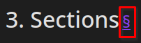

## Basic font emphasis styles
First of all, I think markdown is pretty good if you want to do basic stuff like *italics*, **bold**, ~~strikeout~~, underli--. Oh what?? Markdown doesn't have a syntax for underline you say? Well what am I to do now. Oh maybe because markdown supports HTML5, I can use <u> tags. What now? That doesn't work either because this site can't do it for some inexplicable reason even though it's supposed to?

## Image captions
Don't even get me started on making image captions. Check my last post for evidence of this. I was trying to give credit to the sources where I found my gif and decided to write a bit more. Well, turns out Markdown doesn't exactly have a caption thing for images. Instead, you can either italicize and make it look like it's properly formatted right underneath the photo, or you can make a little table. Well because this site is using a [featured photo](https://hbs.razonyang.com/v1/en/docs/content/#featured-images-selection-order) and I'm not displaying the image using ``````, I can't exactly use

```
|  | 
|:--:| 
| *Space* |
```
Soooo I did the table thing but without linking the image directory, making it just the table title. That made my entire sentence bold. Since Markdown doesn't give tools to resize fonts and styles, I was left there with hideous font.


## Sections
Now onto, sections, look at this. Look above this line right now. It's a little too large wouldn't you say? Why does it have to by like 3 times the size as the regular body of the text? I mean it's nice that there's a little link when you hover over it. I just wish that it would be a smidge bigger than normal body text but not as big as it is now. Maybe double the size of normal body text would do. The last post I did, I just bolded the sections just to give it a go, turned out alright tbh.



## Last thoughts
I mean until I can think of more stuff to criticize about Markdown, I'll end it with this. Markdown is too weird. It needs to have more tools and make it easier to use, so we don't combine multiple languages only for it not to work. 

&nbsp;

This is liluzibird, and I still have no closer.