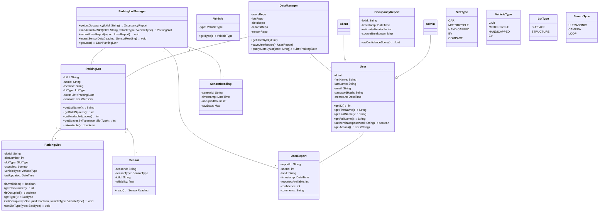

Summary.

<!--more-->

```mermaid
classDiagram
  class ParkingLotManager {
    +getLotOccupancy(lotId: String): OccupancyReport
    +findAvailableSlot(lotId: String, vehicleType: VehicleType): ParkingSlot
    +submitUserReport(report: UserReport): void
    +ingestSensorData(reading: SensorReading): void
    +getLots(): List~ParkingLot~
  }

  class ParkingLot {
    -lotId: String
    -name: String
    -location: String
    -lotType: LotType
    -slots: List~ParkingSlot~
    -sensors: List~Sensor~
    +getLotName(): String
    +getTotalSpaces(): int
    +getAvailableSpaces(): int
    +getSpacesByType(type: SlotType): int
    +isAvailable(): boolean
  }

  class ParkingSlot {
    -slotId: String
    -slotNumber: int
    -slotType: SlotType
    -occupied: boolean
    -vehicleType: VehicleType
    -lastUpdated: DateTime
    +isAvailable(): boolean
    +getSlotNumber(): int
    +isOccupied(): boolean
    +getType(): SlotType
    +setOccupied(isOccupied: boolean, vehicleType: VehicleType): void
    +setSlotType(type: SlotType): void
  }

  class Vehicle {
    -type: VehicleType
    +getType(): VehicleType
  }

  class User {
    -id: int
    -firstName: String
    -lastName: String
    -email: String
    -passwordHash: String
    -createdAt: DateTime
    +getID(): int
    +getFirstName(): String
    +getLastName(): String
    +getFullName(): String
    +authenticate(password: String): boolean
    +getActions(): List~String~
  }

  class Client
  class Admin

  class Sensor {
    -sensorId: String
    -sensorType: SensorType
    -lotId: String
    -reliability: float
    +read(): SensorReading
  }

  class SensorReading {
    -sensorId: String
    -timestamp: DateTime
    -occupiedCount: int
    -rawData: Map
  }

  class UserReport {
    -reportId: String
    -userId: int
    -lotId: String
    -timestamp: DateTime
    -reportedAvailable: int
    -confidence: int
    -comments: String
  }

  class OccupancyReport {
    -lotId: String
    -timestamp: DateTime
    -estimatedAvailable: int
    -sourceBreakdown: Map
    +asConfidenceScore(): float
  }

  class DataManager {
    -usersRepo
    -lotsRepo
    -slotsRepo
    -reportsRepo
    -sensorRepo
    +getUserById(id: int)
    +saveUserReport(r: UserReport)
    +querySlotsByLot(lotId: String): List~ParkingSlot~
  }

  %% Enums (represented as classes for mermaid)
  class SlotType{CAR
  MOTORCYCLE
  HANDICAPPED
  EV
  COMPACT}
  class VehicleType{CAR
  MOTORCYCLE
  HANDICAPPED
  EV}
  class LotType{SURFACE
  STRUCTURE}
  class SensorType{ULTRASONIC
  CAMERA
  LOOP}

  ParkingLot "1" o-- "*" ParkingSlot
  ParkingLot "1" o-- "*" Sensor
  ParkingLotManager "1" -- "*" ParkingLot
  ParkingLotManager "1" -- "*" UserReport
  ParkingLotManager "1" -- "*" SensorReading
  User "1" -- "*" UserReport
  DataManager "1" -- "*" ParkingLot
  DataManager "1" -- "*" User

  Client --|> User
  Admin --|> User
```