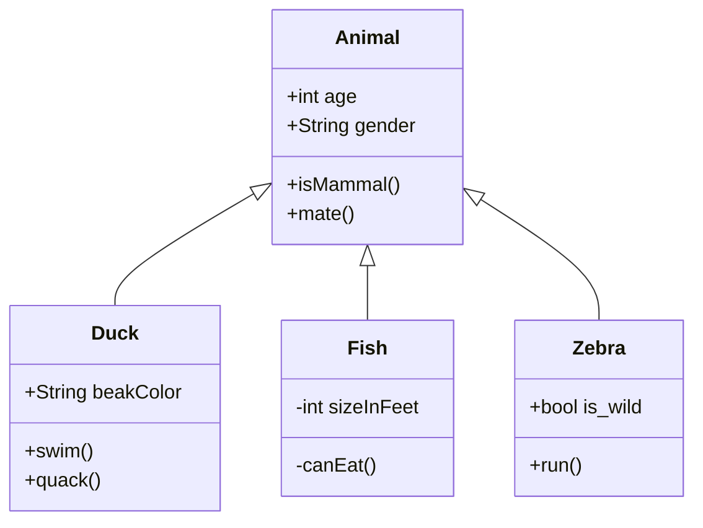

Testing hugo markdown features.

<!--more-->

Red colored text
{style="color: red"}

1. One
2. Two
3. Three

    Three is the third number  
    3rd most important number

these are all the numbers I know

Colons can be used to align columns.

| Tables        | Are           | Cool  |
| ------------- |:-------------:| -----:|
| col 3 is      | right-aligned | $1600 |
| col 2 is      | centered      |   $12 |
| zebra stripes | are neat      |    $1 |

|-------|-------| **Cars**          | Planes        | Trains |
|-------|-------| ------------- |-------------- |--------|
|-------|**People** | 4             |     200       |   1000 |

```goat
      .               .                .               .--- 1          .-- 1     / 1
     / \              |                |           .---+            .-+         +
    /   \         .---+---.         .--+--.        |   '--- 2      |   '-- 2   / \ 2
   +     +        |       |        |       |    ---+            ---+          +
  / \   / \     .-+-.   .-+-.     .+.     .+.      |   .--- 3      |   .-- 3   \ / 3
 /   \ /   \    |   |   |   |    |   |   |   |     '---+            '-+         +
 1   2 3   4    1   2   3   4    1   2   3   4         '--- 4          '-- 4     \ 4

```

Flow chart

graph TD
    A[Christmas] -->|Get money| B(Go shopping)
    B --> C{Let me think}
    C -->|One| D[Laptop]
    C -->|Two| E[iPhone]
    C -->|Three| F[fas:fa-car Car]


Sequence Diagram



sequenceDiagram
    Alice->>+John: Hello John, how are you?
    Alice->>+John: John, can you hear me?
    John-->>-Alice: Hi Alice, I can hear you!
    John-->>-Alice: I feel great!


Class Diagram

````md
```
mermaid
classDiagram
    Animal <|-- Duck
    Animal <|-- Fish
    Animal <|-- Zebra
    Animal : +int age
    Animal : +String gender
    Animal: +isMammal()
    Animal: +mate()
    class Duck{
    +String beakColor
    +swim()
    +quack()
    }
    class Fish{
    -int sizeInFeet
    -canEat()
    }
    class Zebra{
    +bool is_wild
    +run()
    }

```
````




Html is not a programming language [^1]

[^1]: this is a footnote safasds

SYCL[^shovon_2024] is an open industry standard that simplifies parallel programming[^reinders2021data] tasks.


primary
dangerous
warning
note
info
success

{}
Alert Shortcode with Markdown Syntax:
```bash
$ echo 'An example of alert shortcode with the Markdown syntax'
```
{}


**References**:

[^shovon_2024]: [Introduction to SYCL and DPC++](https://arshovon.com/blog/sycl-docker-interactive/)
[^reinders2021data]: Reinders, J., Ashbaugh, B., Brodman, J., Kinsner, M., Pennycook, J., & Tian, X. (2021). Data parallel C++: mastering DPC++ for programming of heterogeneous systems using C++ and SYCL (p. 548). Springer Nature.
